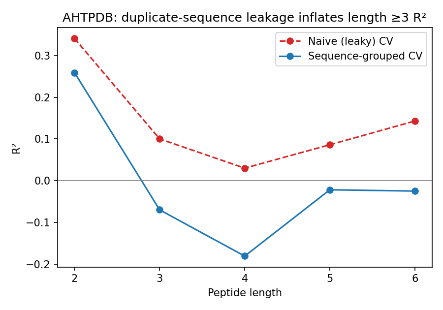
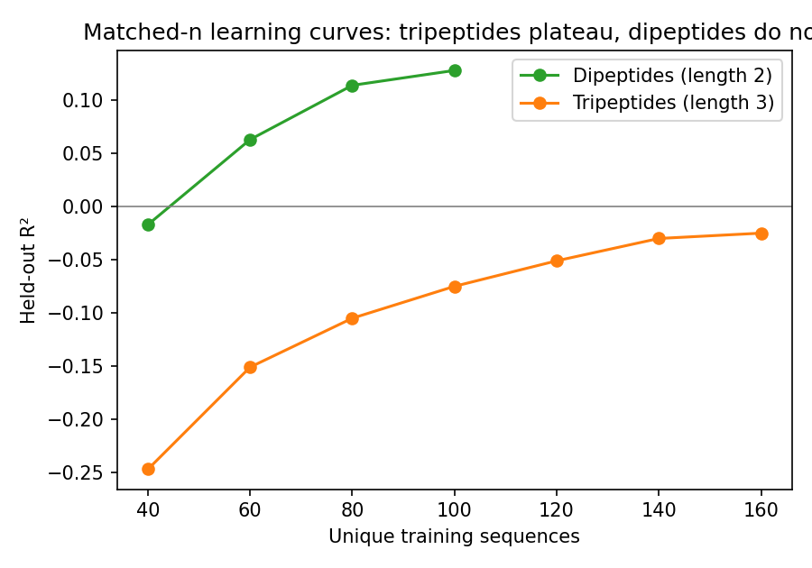

# ACE-inhibitory peptide regression: a leakage-and-elimination audit

This repository investigates why sequence-based regression of ACE-inhibitory peptide
potency (log IC50 / pIC50) is reported to work for very short peptides and to fail for
longer ones — and specifically, whether that failure is a real biological/statistical
ceiling or an artifact of how these compiled datasets are typically evaluated.

## The headline result

On AHTPDB, a peptide-activity database compiled from 400+ independent source studies,
**ordinary (row-wise) cross-validation reports small positive R² at peptide lengths
3–6** — but this signal is not real. It collapses to null once cross-validation folds
are grouped by exact sequence identity, so that no single peptide's repeated
measurements (from different source studies) can appear in both the training and test
fold of the same split:

| Length | n (rows) | n (unique seq.) | Naive CV R² | Grouped CV R² |
|---|---|---|---|---|
| 2 | 467 | 130 | 0.341 ± 0.093 | 0.259 ± 0.149 |
| 3 | 669 | 210 | 0.100 ± 0.062 | **−0.070 ± 0.149** |
| 4 | 244 | 94  | 0.030 ± 0.100 | **−0.181 ± 0.171** |
| 5 | 337 | 133 | 0.086 ± 0.094 | **−0.022 ± 0.101** |
| 6 | 349 | 122 | 0.143 ± 0.109 | **−0.025 ± 0.108** |



Length-2 (dipeptide) predictability survives both protocols and matches an
independent, completely duplicate-free benchmark (Wang et al., 2020) almost exactly.
Length ≥3 does not, under any protocol, once leakage is controlled for — **for
regression.** Classification tells a different story (see next section).

## Regression fails at length ≥3. Classification doesn't (mostly).

Binarizing the same data (median split, and top/bottom-25% quartile split) and testing
with AUC + permutation significance gives a real, positive result :

| Length | n (median / quartile) | Regression R² | AUC (median split) | AUC (quartile split) | Permutation p (quartile) |
|---|---|---|---|---|---|
| 2 | 133 / 69  | 0.267  | 0.734 | 0.885 | 0.005 |
| 3 | 215 / 108 | −0.034 | 0.538 | 0.597 | 0.075 (n.s.) |
| 4 | 90 / 47   | −0.074 | 0.684 | 0.739 | **0.015** |
| 5 | 132 / 67  | −0.030 | 0.582 | 0.685 | **0.015** |
| 6 | 114 / 59  | −0.070 | 0.633 | 0.677 | **0.040** |

Lengths 4, 5, and 6 all show statistically significant classification signal
(permutation p < 0.05) despite regression R² near zero or negative. Length 3 is the
one length that fails under **both** framings (p = 0.075–0.234, not significant).

Read plainly: **the sequence-activity relationship is real and detectable at lengths
4–6 — it's just not linearly/continuously recoverable at this sample size.**
Continuous IC50 regression is a harder, noisier target than "is this peptide clearly
potent or clearly weak," and the data supports discriminating extremes long before it
supports predicting an exact value. This reframes the earlier "representation-invariant
failure" finding: the failure is specific to regression, not to the existence of
signal. Length 3 remains the genuine outlier — it fails even the easier task.

**This alone does not fully explain the length ≥3 null result** — it explains why
naive evaluation *looked* better than it should have, not why length ≥3 peptides
remain unpredictable even after the fix. This repository also tests, and rules out as
the *dominant* explanation, three further candidates:

- **Representation choice** — physicochemical descriptors, full positional one-hot
  encoding, frozen ProtBERT, and frozen ESM-2 embeddings all converge on the same
  near-zero **regression** ceiling at length ≥3. (Classification results above show
  this is a regression-specific limit, not an absence of signal — see above.)
- **Sample size** — matched-training-size learning curves show tripeptide
  predictability plateaus near zero at ~76% of the available unique-sequence pool,
  while dipeptides at a comparable relative pool fraction are still improving.

  
- **Cross-study label noise** — same-sequence measurement disagreement is small
  relative to model residual error at length ≥3 (6–20%), and an independent,
  apparently single-source tripeptide dataset (Jiao et al., 2025) shows the identical
  null result even with cross-study heterogeneity largely removed.

What remains open, honestly: either tripeptide-and-longer ACE activity needs
substantially more data than any single compiled resource here provides, or it needs a
structurally different modeling approach (e.g. explicit subsite-interaction terms).
This repository does not resolve which.

## Relation to prior work

Duplicate/homology leakage inflating peptide bioactivity benchmarks is not a novel
observation in general — see in particular **AutoPeptideML**
(Fernández-Díaz et al., 2024, *Bioinformatics*), which documents this exact failure
mode across 18 peptide bioactivity datasets, including an ACE-inhibitor classification
benchmark, and provides a homology-partitioning tool to address it. What this
repository adds, specifically: a demonstration on a **quantitative IC50 regression**
task (not classification), a direct quantification of *exact*-duplicate leakage in
AHTPDB specifically, and — the part we haven't seen elsewhere — a follow-up
elimination sequence showing that fixing the leakage does *not* by itself restore
predictability, and systematically ruling out the next most obvious explanations
(representation, sample size, label noise) rather than stopping at the leakage catch.
If you know of prior work that already does this combination, please open an issue —
we would genuinely like to know and cite it correctly.

## Repository structure

```
.
├── README.md                    <- you are here
├── DATA_LICENSING.md            <- what's redistributed, what isn't, and why
├── LICENSE                      <- MIT (code only — see DATA_LICENSING.md for data)
├── environment.yml / requirements.txt
├── notebooks/
│   ├── 01_wang2020_baseline_descriptors.ipynb        <- physicochemical descriptor regression
│   ├── 02_wang2020_protbert_embeddings.ipynb         <- frozen ProtBERT representation
│   ├── 03_wang2020_esm2_embeddings.ipynb             <- frozen ESM-2 representation
│   ├── 04_ahtpdb_cleaning_and_leakage_audit.ipynb    <- cleaning + THE LEAKAGE CATCH + label-noise analysis
│   └── 05_learning_curves_and_external_validation.ipynb  <- sample-size and independent-dataset tests
├── data/
│   ├── raw/          <- empty; see raw/README.md for how to obtain source files yourself
│   ├── external/      <- Jiao et al. (2025) table, CC BY-NC, redistributed with citation
│   └── derived/       <- our own cleaned/harmonized AHTPDB derivative + disagreement stats
└── docs/
    ├── findings_and_evaluation.md   <- full narrative writeup, all epistemic caveats included
    └── figures/                     <- the two figures above, as standalone PNGs
```

## Reproducing this

1. Clone this repo.
2. `pip install -r requirements.txt` (or `conda env create -f environment.yml`).
3. Obtain the two raw source files yourself — see `data/raw/README.md` for exactly
   what's needed and why they aren't bundled here.
4. Run the notebooks in order, 01 → 05. Notebooks 04 and 05 are fully self-contained
   and will reproduce the leakage catch and learning-curve results from raw AHTPDB
   data alone (or you can skip straight to using `data/derived/` if you just want to
   reproduce the downstream analysis without re-running the cleaning step).

## Status

This is a research diagnostic, not a maintained benchmark package or a predictive
model release. It was prepared as a workshop submission (ICBINB-BIO @ NeurIPS 2026,
negative-results track) but ultimately not submitted; it's released here as a
reproducible artifact rather than left unfinished on a laptop. Issues and corrections
are genuinely welcome, especially on anything flagged as unverified in
`DATA_LICENSING.md` or `docs/findings_and_evaluation.md`.
